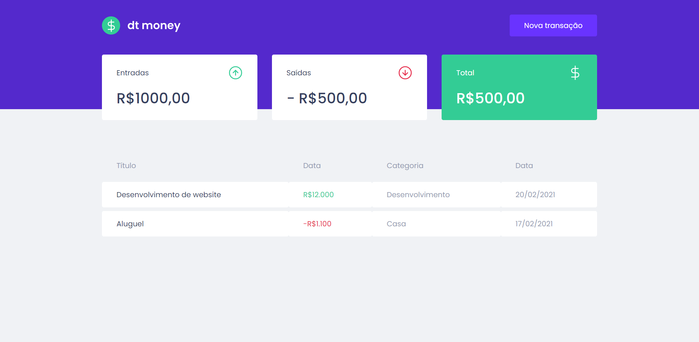

<h1 align="center">
    dtmoney 
</h1>

  <a href="#-tecnologias">Tecnologias</a>&nbsp;&nbsp;&nbsp;|&nbsp;&nbsp;&nbsp;
  <a href="#-projeto">Projeto</a>&nbsp;&nbsp;&nbsp;|&nbsp;&nbsp;&nbsp;

 

Dashboard

  

 

Modal que aparece quando clica em "Nova transação"

  

## 🚀 Tecnologias

Esse projeto foi desenvolvido(até o momento) com as seguintes tecnologias:

- TypeScript
- CSS/styled-components
- ReactJS
- miragejs
- Axios

## 💻 Projeto

Este projeto foi feito para melhorar minhas skills em programação.
Para rodar na sua máquina baixe o arquivo zipado, extraia e rode no terminal:
  yarn(Para instalar o arquivo yarn.lock e todas as dependencias da aplicação)
  yarn start(Para iniciar a aplicação)
PS: Em desenvolvimento.